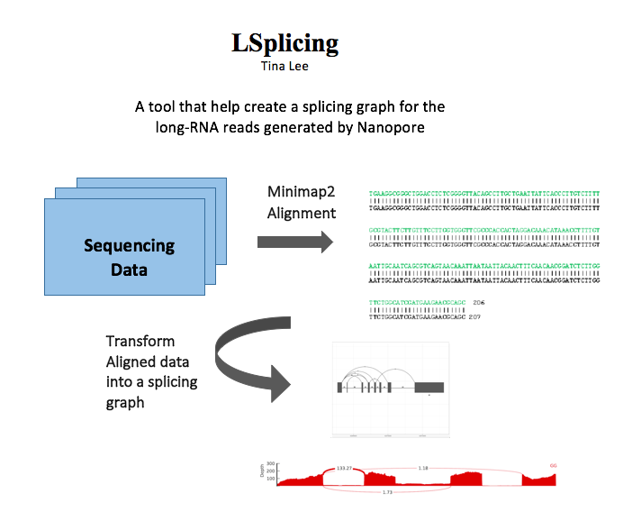

# LSplicing

<!-- badges: start -->
<!-- badges: end -->

## Description

The goal of LSplicing is to plot a splicing graph for long-read RNA alignments generated by Minimap2.

## Installation

You can install the released version of LSplicing using

``` r
require("devtools")
install_github("leetina4/LSplicing")
library("LSplicing")
```

## Overview

 

## Contribution
The author of this package is Tina Lee. The functions avaliable within this package include:

- countReads
- combineTranscripts
- readsCoverage
- plotReads

The first function countReads reads the path of the file that store the alignments and the path of the file that store the reference coordinates. This function would output two tables, one table containing count of exon combinations for each read and the other table containing exon coordinates of different genes. A helper combineTranscript is there for combining all transcript exons coordinates for target gene. 

A helper function that is needed to plot a splicing graph is readsCoverage, which calculates the coverage of long-read RNAs. This function is used in plotReads function. Finally, plotReads function, which takes in the results from countReads and readsCoverage and generates a splicing graph using R package, ggplot2. 


