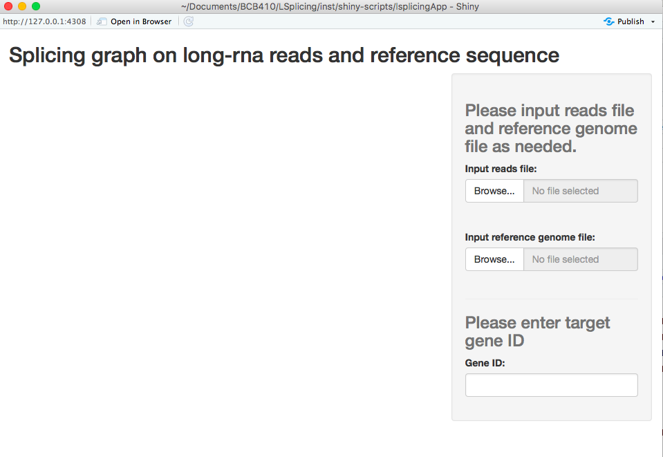

```{r, include = FALSE}
knitr::opts_chunk$set(
  collapse = TRUE,
  comment = "#>"
)
```


## Introduction
LSplicing is a convenient R package for alternative splicing analysis and visualization.

The pipeline requires two steps. First, long-rna alignments generated by minimap will be processed by using the [R GenomicAlignment package](https://bioconductor.org/packages/release/bioc/html/GenomicAlignments.html) and the function summarizeOverlaps is used to calculate the exon combination of each alignments. 

The comprehensive visualization component of the pipeline then produce an informative ggplot using [R ggplot2 package](https://cran.r-project.org/web/packages/ggplot2/index.html)

## A quick start for using `LSplicing` package
  User can download the pacakge outside of project.
```{r, results='hide'}
devtools::install_github("leetina4/LSplicing")
library(LSplicing)
```

User can use two functions in LSplicing package. One is runLSplicingApp(), which is used to output the shiny app and the other is countReads(), which is used to output the counts of exon combination of a target gene.

### Example usage
```{r, eval=FALSE}
runLSplicingApp() # Pop out the shiny page

readsFile <- system.file("extdata", "mlx_reads.sorted.bam", package = "LSplicing")
refGenomeFile <- system.file("extdata", "example_refCoord.gff3", package = "LSplicing")

countReads(input$readsFile$datapath, input$refGenomeFile$datapath)
# Return the list of two data frames. Fisrt data frame contains new exon coordinates created and second data frame contains the exon combinations of each read.
```

### Example outcomes
#### `runLSplicing` function
```{r, eval=FALSE}
runLSplicingApp() # Pop out the shiny page
```
{width=90%}


## More Directions
### Input for `countReads` function
  There are two required input files needed to analysis the data. They are reads file and reference genome file. The reads file should be in BAM format and the reference genome file should be in BED or GFF format.
  
### Input for shiny app (after run `runLSplicing`)
  There are 3 required input files needed. The first two file inputs are the same as the input for `countReads` function. The last input required is the target gene ID, which the user need to enter manually.
  
  Some **default** inputs for shiny app:
  
1. **Input reads file** is `./inst/extdata/` in `LSplicing` package
1. **Input reference genome file** is `./inst/extdata/example_refCoord.gff3` in `LSplicing` package

### Not exported functions
  There are several functions that could be used by users but are used to process the data.
  
1. `combineTranscripts` is the function that combine the exon coordinates of transcripts of target gene.  
1. `readCoverage` is for calculating coverage of the reads and this information will be display in the resulting splicing graph.


